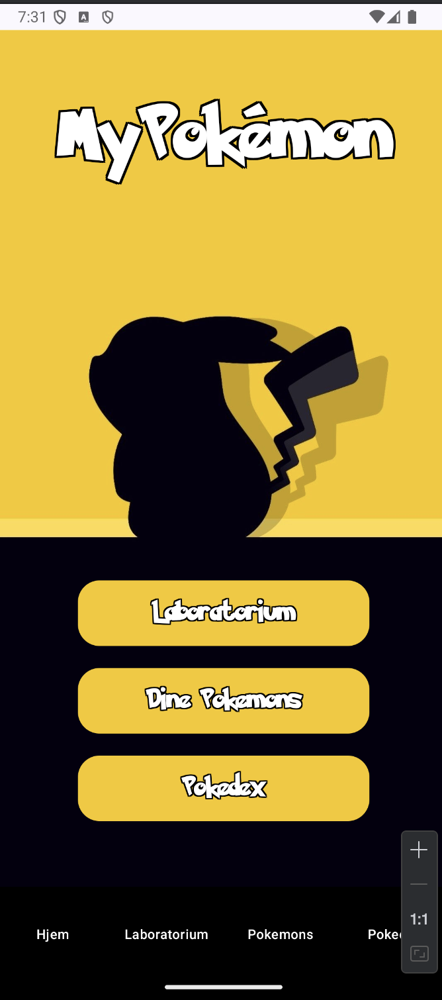
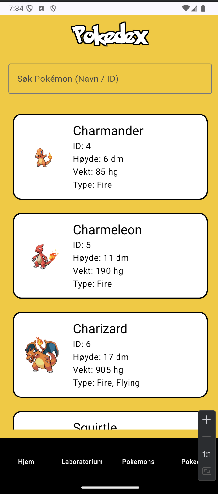
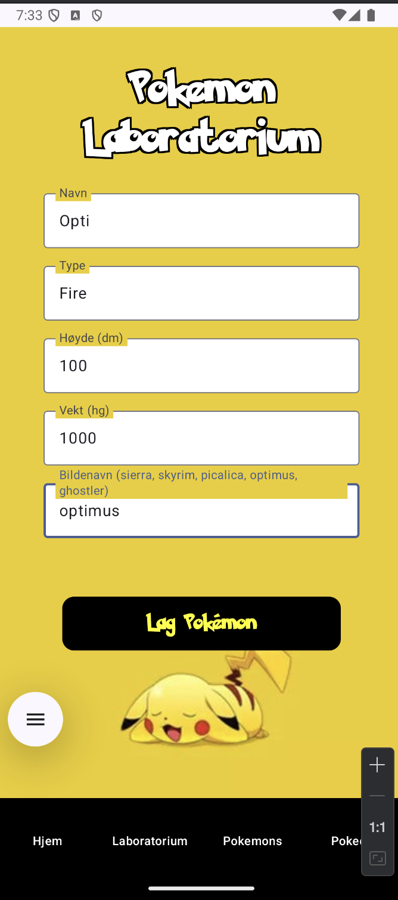
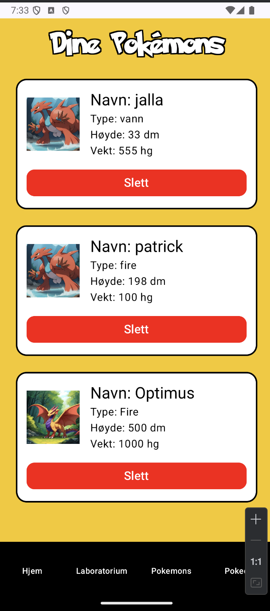

# PokemonApp (Android · Jetpack Compose)

A native Android application built with **Jetpack Compose**.  
The app allows users to browse Pokémon fetched from the public **PokéAPI**, search by name or ID,
and create custom Pokémon stored locally on the device.

## Screenshots

  
  

  
  

## Features

- 🔎 Search Pokémon by name or ID
- ♾️ Infinite scrolling / lazy loading
- 🌐 Fetches data from the public PokéAPI using Retrofit
- 💾 Create and store custom Pokémon locally using Room
- 🧭 Navigation with Navigation Compose and bottom navigation
- 🎨 Modern UI built with Jetpack Compose (Material 3)

## Tech Stack

- **Kotlin**
- **Jetpack Compose**
- **Material 3**
- **Navigation Compose**
- **Retrofit 2**
- **Gson**
- **Kotlin Coroutines**
- **Room (local database)**
- **Hilt (dependency injection)**

## API

This project uses the public PokéAPI:

- Base URL: `https://pokeapi.co/api/v2/`
- Pokémon endpoint: `pokemon/{id}`

## Requirements

- Android Studio (recent version)
- JDK 17 (recommended)
- `minSdk 24`
- `targetSdk 34`
- `compileSdk 34`

## How to Run

1. Clone the repository:
   ~~~bash
   git clone https://github.com/Daatland/MyAndroidApp.git
   ~~~
2. Open the project in **Android Studio**
3. Let **Gradle Sync** finish
4. Run the app on an emulator or physical device

> **Note:** An active internet connection is required to load Pokémon from the API.

## What I Learned

- Building modern UIs with Jetpack Compose
- Handling API requests using Retrofit and Coroutines
- Implementing local persistence with Room
- Structuring an Android app with navigation and state handling

